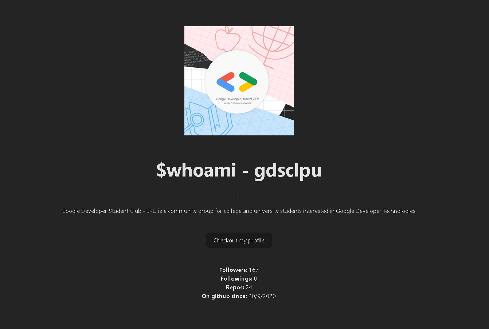

## Mini Github Profile

This is a simple project to show a mini github profile using the github API.

## How to run the project

1. Clone the repository
2. Run `npm install`
3. Run `npm dev`

## Info
>_Made during GSC bootcamp 2024_